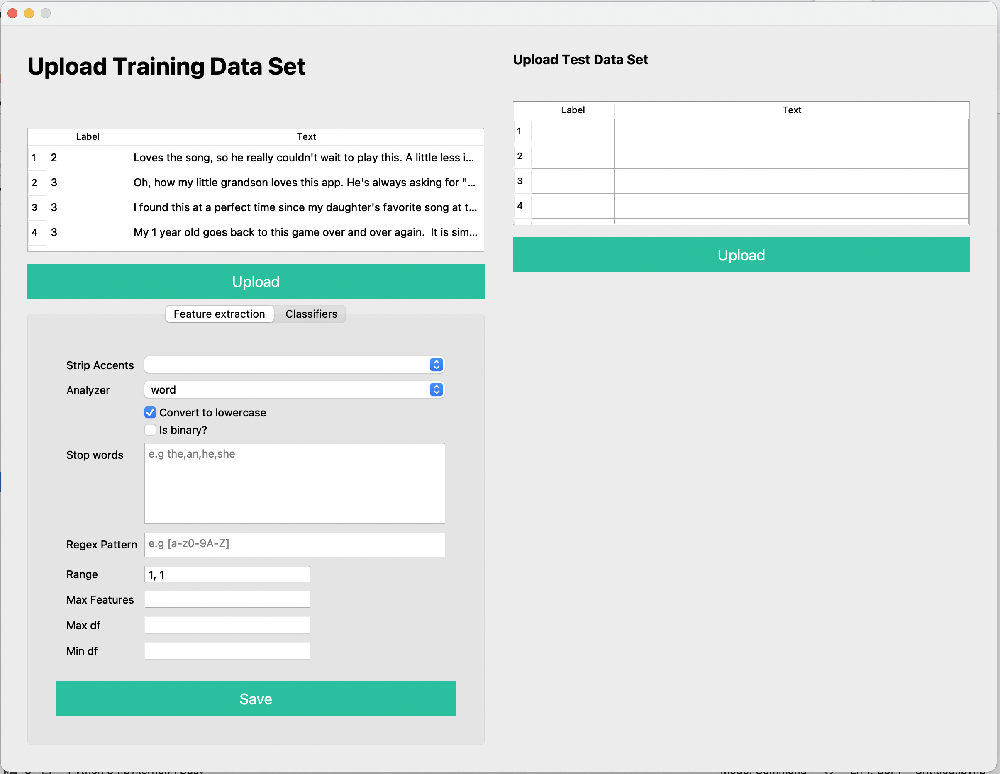

# SentimentAnalysis-Easy-GUI

## Demo

## About
This application was designed for my MSc project. The application is built with PyQt. It simulates the whole cycle for Sentiment analysis.
It is recommended for introducing and demoing Sentiment analysis to students or nonexperts, as teaching Sentiment analysis with just code and textbooks or theory can put people off.

They can see in real- time how different parameters influence the outcomes of a classifier in Sentiment analysis and visualise how well the model performed with a graph and metrics table.
There are some gaps and areas of improvement in the application. For complicated and industrial-heavy performance, the application cannot compete with established tools like WEKA, Orange, KNIME etc.

## Classifiers
4 classifiers were chosen to build models for sentiment analysis. They include:.
<ol>
  <li>Support Vector Machines (SVC AND LVC)</li>
  <li>KNN</li>
  <li>Decision tree</li>
  <li>Naïve Bayes(multinomial and complement)</li>
</ol> 

For each classifier, an option to fine-tune certain parameters was provided based on the
scikit library.

## Dataset

Two different datasets were provided. They both contain 4000 lines:
<ol>
  <li>[text_emotion.csv](https://github.com/ifeoluwak/SentimentAnalysis-Easy-GUI/blob/main/text_emotion.csv)</li>
  <li>[train.txt](https://github.com/ifeoluwak/SentimentAnalysis-Easy-GUI/blob/main/train.txt)</li>
  <li>Decision tree</li>
  <li>Naïve Bayes(multinomial and complement)</li>
</ol>

You can provide your own dataset.

## Installation

`git clone` project.

Make sure you have a minimum of python 3 setup on your laptop. For the best experience, it is recommended to use Anaconda IDE.

Open the `app.ipynb` file on your IDE and run the program.

